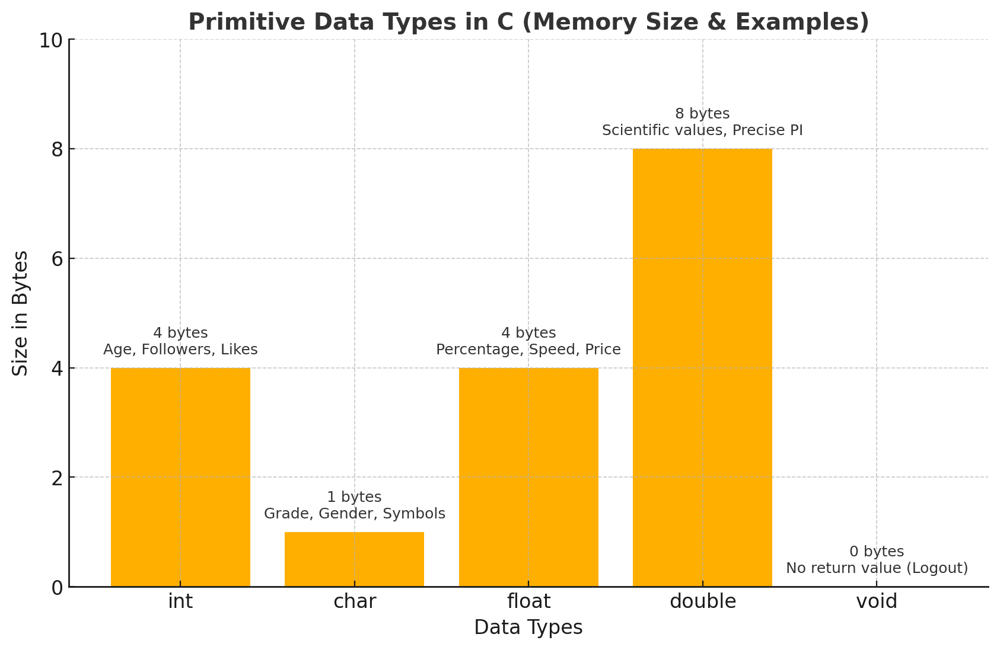

# 05.2: Primitive Data Types in C

Every app you use — whether it’s **Instagram**, **YouTube**, or even **CodingGita’s student portal** — deals with different types of data:

* Number of likes 👍 → **integer**
* Video watch time ⏱️ → **float**
* Your grade in class 🎓 → **character**
* High-precision calculations 📊 → **double**
* A function that doesn’t return anything → **void**

In C, these are handled by **primitive data types**.

---

## 1. `int` (Integer)

* Stores **whole numbers** (positive, negative, or zero).
* Cannot store decimals.

```c
int age = 18;
int followers = 2500;
int balance = -500;   // negative value possible
```

### Size & Range:

* On most modern systems: **4 bytes**
* Range: **-2,147,483,648 to 2,147,483,647** (about ±2 billion)

### Where it’s used:

* Student roll numbers.
* Number of likes on a post.
* Counting loops (like `for (int i=0; i<10; i++)`).

---

## 2. `char` (Character)

* Stores a **single character** in single quotes `' '`.
* Internally stored as an **ASCII code** (numeric).

```c
char grade = 'A';
char symbol = '#';
```

### Size & Range:

* **1 byte**
* Range: **-128 to 127** (signed char) or **0 to 255** (unsigned char)

### ASCII Example:

```c
char c = 'A';
printf("%d", c);   // Output: 65 (ASCII of 'A')
```

👉 Fun fact: When you type `'A'`, C actually stores `65` behind the scenes.

---

## 3. `float` (Floating-point number)

* Stores **decimal (fractional) numbers** with limited precision.

```c
float price = 99.99;
float pi = 3.14;
```

### Size & Range:

* **4 bytes**
* Precision: \~6 decimal places

### Where it’s used:

* Student’s percentage: `82.5`.
* Game character speed: `1.75`.
* YouTube watch time: `15.25 minutes`.

⚠️ Limitation: `float` cannot represent very large/precise decimals accurately (round-off errors possible).

---

## 4. `double` (Double Precision Floating-point)

* Like `float`, but **more precision**.
* Used when accuracy matters (finance, scientific calculations).

```c
double pi = 3.141592653589793;
double marks = 92.125;
```

### Size & Range:

* **8 bytes**
* Precision: \~15 decimal places

👉 Example:

```c
float f = 3.1415926535;
double d = 3.1415926535;
printf("Float: %.10f\n", f);   // 3.1415927410
printf("Double: %.10f\n", d); // 3.1415926535
```

Notice how **float loses accuracy** after a few digits, while **double keeps it**.

---

## 5. `void` (No Value)

* Represents “nothing” — absence of data.
* Used mainly in two cases:

### A. Functions with No Return Value

```c
void greet() {
    printf("Welcome to CodingGita!\n");
}
```

### B. Generic Pointers (advanced, later)

* `void *` pointer can point to any data type.

👉 Example from daily apps:

* Clicking "Logout" → doesn’t return a value, just performs an action.

---

## 6. Memory Sizes Recap



Here’s a **visual diagram** to go with the article — showing **C primitive data types, their typical memory sizes, and real-world examples**:

* `int` → 4 bytes (Age, Followers, Likes)
* `char` → 1 byte (Grade, Gender, Symbols)
* `float` → 4 bytes (Percentage, Speed, Price)
* `double` → 8 bytes (Scientific values, Precise PI)
* `void` → 0 bytes (No return value, e.g., Logout function)


| Type   | Size (bytes) | Range (approx)                          |
| ------ | ------------ | --------------------------------------- |
| int    | 4            | -2,147,483,648 to 2,147,483,647         |
| char   | 1            | -128 to 127 (signed) / 0–255 (unsigned) |
| float  | 4            | \~6 decimal digits                      |
| double | 8            | \~15 decimal digits                     |
| void   | 0            | no value                                |

---

## 7. Demo Program: Primitive Data Types

```c
#include <stdio.h>

int main() {
    int age = 20;
    char grade = 'A';
    float percentage = 82.5;
    double pi = 3.141592653589793;

    printf("Age: %d\n", age);
    printf("Grade: %c\n", grade);
    printf("Percentage: %.2f\n", percentage);
    printf("Pi (more precise): %.15lf\n", pi);

    return 0;
}
```

### Sample Output:

```
Age: 20
Grade: A
Percentage: 82.50
Pi (more precise): 3.141592653589793
```

---

## 8. Why These Matter

* Without `int`, loops can’t run.
* Without `char`, names/grades can’t exist.
* Without `float/double`, no percentages or prices.
* Without `void`, functions can’t just "do stuff".

👉 Every program, from **calculators** to **Instagram’s like system**, relies on these basic data types.

---


