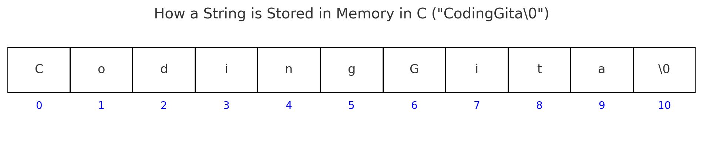

# 05.7: Strings in C (Brief Introduction)

Whenever you use apps like **WhatsApp, Instagram, or CodingGita’s portal**, you’re constantly dealing with **text**:

* Your name: `"Jenil"`
* A chat message: `"Hello, how are you?"`
* A password: `"coding123"`

In C, text data like this is represented using **Strings**. But unlike modern languages (Python, Java, JavaScript), C does **not** have a built-in string type. Instead, strings are represented as **character arrays**.

---

## 1. What is a String in C?

* A **string is simply an array of characters**.
* The difference from a normal array is that it **must end with a special character** called the **null character** `\0`.

```c
char name[] = "CodingGita";
```

Internally stored as:

```
C   o   d   i   n   g   G   i   t   a   \0
```

👉 The `\0` marks the end of the string.
Without it, C won’t know where the text stops.


Here’s the **memory diagram** showing how `"CodingGita"` is stored in C:



* Each **character** takes **1 byte**.
* The last slot always contains **`\0` (null terminator)**, marking the end of the string.
* Without `\0`, C won’t know where the string ends.

This visualization helps clearly see that **a string in C is just a character array ending with `\0`**.

---

## 2. Declaring Strings

### A. Using String Literal (easy way)

```c
char course[] = "BTech";
```

Automatically adds the `\0` at the end.

### B. Using Character Array (manual way)

```c
char course[6] = {'B', 'T', 'e', 'c', 'h', '\0'};
```

Here, we **explicitly** add `\0`.

---

## 3. Printing Strings

```c
#include <stdio.h>
int main() {
    char name[] = "Jenil";
    printf("Name = %s\n", name);
    return 0;
}
```

**Output:**

```
Name = Jenil
```

👉 `%s` is the format specifier for strings.

---

## 4. Why `\0` is So Important

If you forget the null terminator, C will **keep reading memory** until it finds a random `\0`, causing garbage output or even a crash.

```c
#include <stdio.h>
int main() {
    char word[4] = {'C', 'S', 'E', '!'};
    printf("%s\n", word);   // ❌ Missing '\0'
    return 0;
}
```

Possible Output:

```
CSE!▒▒▒▒▒▒▒▒▒▒▒▒▒
```

👉 This happens because there is **no `\0`**, so C prints memory junk after the array.

---

## 5. Strings vs Characters

* **Character (`char`)** → single symbol

  ```c
  char grade = 'A';   // One character
  ```
* **String (`char[]`)** → sequence of characters ending with `\0`

  ```c
  char name[] = "Arjun";   // Multiple characters
  ```

---

## 6. Demo Program: String Basics

```c
#include <stdio.h>
int main() {
    char college[] = "CodingGita";
    char dept[4] = {'C', 'S', 'E', '\0'};

    printf("College = %s\n", college);
    printf("Department = %s\n", dept);

    return 0;
}
```

**Output:**

```
College = CodingGita
Department = CSE
```

---

## 7. Recap

* **String = character array + `\0`.**
* `%s` used for printing strings.
* Forgetting `\0` causes garbage output.
* Declared either with string literal `"text"` or character array with `\0`.

👉 For now, just remember: **strings are arrays of characters ending with `\0`.**

