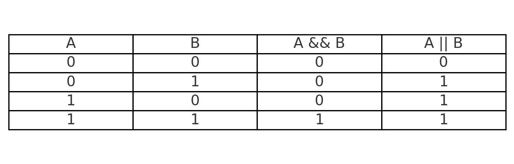

# 06.3: Logical Operators in C (`&&`, `||`, `!`)

Logical operators allow us to **combine conditions** or **reverse a condition’s meaning**.
They are mainly used inside **`if`, `while`, and `for`** statements.

---

## 1) Operators

1. **AND (`&&`)** → True only if **both conditions** are true.
2. **OR (`||`)** → True if **at least one condition** is true.
3. **NOT (`!`)** → Reverses the truth value (true → false, false → true).

---

## 2) Example: Checking conditions

```c
#include <stdio.h>
int main() {
    int age = 20, attendance = 85;

    printf("age >= 18 && attendance >= 75 -> %d\n", (age >= 18) && (attendance >= 75));
    printf("age < 18 || attendance >= 75  -> %d\n", (age < 18)  || (attendance >= 75));
    printf("!(age < 18)                   -> %d\n", !(age < 18));

    return 0;
}
```

### Output:

```
age >= 18 && attendance >= 75 -> 1
age < 18 || attendance >= 75  -> 1
!(age < 18)                   -> 1
```

---

## 3) Truth Table (Quick Reference)



| A | `!A` |
| - | ---- |
| 0 | 1    |
| 1 | 0    |

Here’s the **truth table image** for logical operators `&&` (AND) and `||` (OR).

* `A && B` is `1` **only if both are 1**.
* `A || B` is `1` if **at least one is 1**.
* `!A` (NOT) flips the value (`1 → 0`, `0 → 1`).

---

## 4) Common Mistakes

### 4.1 Using `=` instead of `==`

```c
int x = 5;
if (x = 0) {   // ❌ assignment, not comparison
    printf("True\n");
}
```

✅ Correct:

```c
if (x == 0) {  // comparison
    printf("True\n");
}
```

### 4.2 Not grouping with parentheses

```c
if (age >= 18 && attendance >= 75 || cgpa > 7.0)
    printf("Eligible\n");
```

This can confuse—better write:

```c
if ((age >= 18 && attendance >= 75) || cgpa > 7.0)
    printf("Eligible\n");
```

---

## 5) Real-life Examples

1. **Student eligibility check**

```c
if (cgpa >= 7.0 && attendance >= 80) {
    printf("Eligible for placement\n");
}
```

2. **At least one pass criteria**

```c
if (marks >= 40 || graceMarks == 1) {
    printf("Pass\n");
}
```

3. **Toggle using NOT**

```c
int isWeekend = 0;
if (!isWeekend) {
    printf("It's a weekday, attend classes!\n");
}
```

---

## 6) Key Takeaways

* `&&` → needs **all true**.
* `||` → needs **at least one true**.
* `!` → flips the result.
* Use **parentheses** to make logic clear.
* Always use `==` for comparison, not `=`.

---


## 7) Short‑Circuit Evaluation (VERY Important)

* `A && B`: If **A is false**, C **skips** evaluating B (no need).
* `A || B`: If **A is true**, C **skips** evaluating B (already true).

This saves time and prevents errors (e.g., dividing by zero).

### 7.1 Safe division using `&&`

```c
#include <stdio.h>
int main() {
    int a = 10, b = 0;

    // B is evaluated only if (b != 0) is true
    if (b != 0 && (a / b) > 2) {
        printf("Quotient > 2\n");
    } else {
        printf("Either b is 0 or quotient <= 2\n");
    }
    return 0;
}
```

### 7.2 Avoiding function side effects via short‑circuit

```c
#include <stdio.h>

int dangerous_eval() {
    printf("This should not run!\n");
    return 1;
}

int main() {
    int ok = 0;
    // Right side won’t run because left is false
    if (ok && dangerous_eval()) {
        printf("Won't reach here\n");
    }
    return 0;
}
```

**Output**

```
(nothing printed)
```

No “This should not run!” → proof that the RHS was skipped.

---

## 8) Realistic checks (relational + logical)

### 8.1 Placement eligibility (CodingGita portal)

```c
#include <stdio.h>
int main() {
    float cgpa = 7.9;
    int backlogs = 0;
    int attendance = 86;

    int eligible = (cgpa >= 7.0) && (backlogs == 0) && (attendance >= 75);
    printf("Eligible: %d\n", eligible);
    return 0;
}
```

### 8.2 Login: username OR email + password

```c
#include <stdio.h>
#include <string.h>

int main() {
    char user[20] = "codinggita";
    char inputUser[20] = "codinggita";
    char inputEmail[40] = "help@codinggita.com";
    char pass[20] = "cg@123";
    char inputPass[20] = "cg@123";

    int auth = ( (strcmp(inputUser, user) == 0) || (strcmp(inputEmail, "help@codinggita.com") == 0) )
               && (strcmp(inputPass, pass) == 0);

    printf("Auth success: %d\n", auth);
    return 0;
}
```

---

## 9) Operator Precedence (Where do logicals sit?)

From high to low (partial list you’ll use daily):

1. `!` (logical NOT)
2. Relational `< <= > >=`
3. Equality `== !=`
4. `&&`
5. `||`

**Example**

```c
int r = 2 + 3 * 4 > 10 && 5 == 5 || 0;
// 2 + 12 > 10 && 1 || 0
// 14 > 10 && 1 || 0
// 1 && 1 || 0
// 1 || 0 -> 1
```

👉 When unsure, **use parentheses**. They also make your intent clear.

---

## 10) Common Pitfalls (with code)

### 10.1 Using `=` instead of `==` in conditions

```c
#include <stdio.h>
int main() {
    int a = 5;
    if (a = 0) {                 // ❌ assignment, sets a to 0, condition becomes false
        printf("True\n");
    } else {
        printf("False\n");       // prints False
    }
    return 0;
}
```

**Fix:** `if (a == 0)`

---

### 10.2 Assuming non‑0 is always `1`

```c
#include <stdio.h>
int main() {
    int x = 42;                 // truthy
    printf("%d\n", x && 5);     // 1 (true && true)
    printf("%d\n", x || 0);     // 1
    printf("%d\n", !x);         // 0
    return 0;
}
```

**Note:** Any **nonzero** is treated as true when evaluated, but `x && y` / `x || y` produce **0 or 1** as results.

---

### 10.3 Short‑circuit side effects

```c
#include <stdio.h>
int inc(int *p) { (*p)++; return 1; }

int main() {
    int a = 0, b = 0;

    // Left is 0 → RHS won’t run, so b stays 0
    if (a && inc(&b)) { }
    printf("a=%d b=%d\n", a, b); // a=0 b=0

    a = 1;
    if (a && inc(&b)) { }
    printf("a=%d b=%d\n", a, b); // a=1 b=1
    return 0;
}
```

---

### 10.4 Guarding against divide‑by‑zero (good pattern)

```c
if (den != 0 && (num / den) > 10) { /* safe */ }
```

Don’t write:

```c
if ((num / den) > 10 && den != 0) { /* UB/crash possible */ } // ❌
```

---

## 11) De Morgan’s Laws (clean up complex NOTs)

* `!(A && B)`  ≡  `(!A) || (!B)`
* `!(A || B)`  ≡  `(!A) && (!B)`

**Example:**

```c
// Not (user is verified AND age >= 18)
if (!(verified && age >= 18)) { /* ... */ }

// Equivalent (often more readable)
if (!verified || age < 18) { /* ... */ }
```

---

## 12) Multiple code examples (with expected outputs)

### 12.1 Age range check (inclusive)

```c
#include <stdio.h>
int main() {
    int age = 18;
    printf("%d\n", age >= 18 && age <= 60); // 1
    return 0;
}
```

### 12.2 “At least one” condition

```c
#include <stdio.h>
int main() {
    int highMarks = 0, highAttendance = 1;
    printf("%d\n", highMarks || highAttendance); // 1
    return 0;
}
```

### 12.3 Toggle logic with `!`

```c
#include <stdio.h>
int main() {
    int isWeekend = 0;
    printf("%d\n", !isWeekend); // 1 → “it’s a weekday”
    return 0;
}
```

### 12.4 Combining three checks

```c
#include <stdio.h>
int main() {
    int cgpaOK = 1, noBacklog = 1, attendanceOK = 0;
    int eligible = cgpaOK && noBacklog && attendanceOK;
    printf("%d\n", eligible); // 0
    return 0;
}
```

### 12.5 Safe array access pattern

```c
#include <stdio.h>
int main() {
    int idx = 5, n = 10;
    int ok = (idx >= 0) && (idx < n);
    printf("Index valid: %d\n", ok); // 1
    return 0;
}
```

---

## 13) Mini Applications (you can extend later)

1. **Strong password gate**

```c
int lenOK = len >= 8;
int hasDigit = digits >= 1;
int hasUpper = uppers >= 1;
if (lenOK && hasDigit && hasUpper) printf("Strong\n");
```

2. **Semester pass**

```c
if ((avg >= 40 && internals >= 20) || graceApproved) printf("Pass");
```

3. **Filter posts**

```c
if ((likes > 1000 || comments > 100) && !isPrivate) showPost();
```

---

## 14) Quick Checklist

* Combine conditions with `&&` and `||`; invert with `!`.
* Results are **0 or 1**; any nonzero is “truthy” when evaluated.
* **Short‑circuit** protects you (place “safe” checks first).
* Avoid `=` vs `==` mistakes.
* Use parentheses for clarity & to control order.
* Apply **De Morgan’s laws** to simplify `!` of complex expressions.

---

