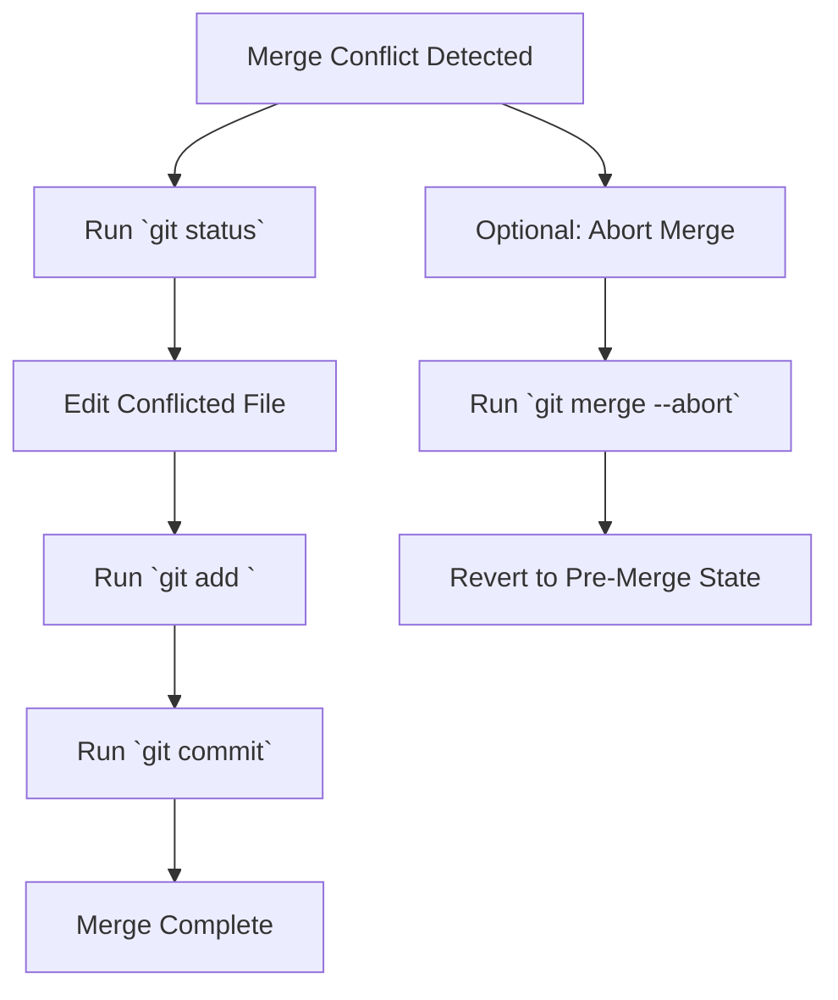

# ⚠️ Resolving Merge Conflicts in Git – CodingGita Guide

## 📌 What is a Merge Conflict?

A merge conflict occurs when Git cannot automatically combine changes from two branches because they modify the same part of a file differently. Think of it like two people editing the same paragraph in a shared Google Doc — you need to decide which changes to keep.

---

## 🛠 When Do Merge Conflicts Happen?

Merge conflicts typically occur during:

- **Merging branches** (`git merge feature-branch`)
- **Pulling changes** from a remote repository (`git pull`)
- **Rebasing branches** (`git rebase main`)
- **Cherry-picking commits** (`git cherry-pick <commit-id>`)

---

## 🔍 Example Scenario (Real-life analogy)

Imagine you and your friend are writing a book. You work on a file called `story.txt` in the `main` branch:

```text
Once upon a time, there was a brave knight.
```

Your friend works on a `feature` branch and changes it to:

```text
Once upon a time, there was a clever wizard.
```

When you merge `feature` into `main`, Git can't decide whether to keep the knight or the wizard — this causes a merge conflict.

---

## 📄 How Git Shows a Merge Conflict

Git marks the conflicted file like this:

```text
<<<<<<< HEAD
Once upon a time, there was a brave knight.
=======
Once upon a time, there was a clever wizard.
>>>>>>> feature
```

- **`<<<<<<< HEAD`**: Your current branch's version (`main`)
- **`=======`**: Separates the two conflicting versions
- **`>>>>>>> feature`**: The incoming branch's version (`feature`)

---

## 🚀 Steps to Resolve a Merge Conflict

1. **✅ Check which files have conflicts**

   ```bash
   git status
   ```

   **Output example:**
   ```bash
   both modified: story.txt
   ```

2. **✅ Open the conflicted file and decide**

   Edit `story.txt` to keep one version or combine both. Example merged version:
   ```text
   Once upon a time, there was a brave knight and a clever wizard.
   ```

3. **✅ Mark the conflict as resolved**

   ```bash
   git add story.txt
   ```

4. **✅ Complete the merge**

   ```bash
   git commit
   ```

---

## 💡 Pro Tip: Abort Merge

To cancel the merge and revert to the pre-merge state:

```bash
git merge --abort
```

---

## 🎯 Real-Life Analogy

Git acts like a **mediator in a group project**:

1. You submit your version.
2. Your friend submits theirs.
3. Git says: "You both edited the same spot — please decide what stays."

---

## 🏠 Hostel Life Example

**CodingGita Hostel Menu Conflict:**

- **Main branch**: "Monday: Paneer Butter Masala"
- **Feature branch**: "Monday: Paneer Tikka Masala"
- **Conflict**: Both branches changed Monday's menu
- **Resolution**: "Monday: Paneer Butter Tikka Masala" (combining both)

---

## 📚 Summary Table

| Command              | Purpose                                      |
|----------------------|----------------------------------------------|
| `git status`         | Shows conflicted files                       |
| `git merge --abort`  | Stops merge and reverts to pre-merge state   |
| `git add <file>`     | Marks a file as conflict-resolved            |
| `git commit`         | Finalizes the merge after resolving conflicts|

---

## 🔧 Advanced Conflict Resolution

### Using a Merge Tool

Use a visual merge tool (e.g., VS Code, Beyond Compare) to simplify conflict resolution:

```bash
git mergetool
```

This opens a graphical interface to choose between conflicting changes.

### Viewing Conflict Markers

To see differences between conflicted versions:

```bash
git diff
```

This highlights the conflicting changes in the terminal.

---

## 💡 Best Practices

- **Pull before merging** to reduce conflicts (`git pull origin main`).
- **Use descriptive commit messages** to clarify changes.
- **Test your code** after resolving conflicts to ensure functionality.
- **Communicate with teammates** to avoid overlapping changes.

---

## 📝 Summary

- **Merge conflicts** arise when Git can't auto-merge changes.
- **Conflict markers** (`<<<<<<<`, `=======`, `>>>>>>>`) show where conflicts occur.
- **Manual resolution** involves choosing or combining changes.
- **Test after resolving** to verify the code works.
- **Use `git merge --abort`** to undo a problematic merge.

---

## 🚀 Next Topic

Explore **Advanced Git Workflows** and **Team Collaboration Strategies** in our [next guide](advanced-git-workflows.md).

---

## 📊 Merge Conflict Resolution Flowchart



---

*This guide is part of the CodingGita Project - helping developers master Git fundamentals through relatable examples.*
